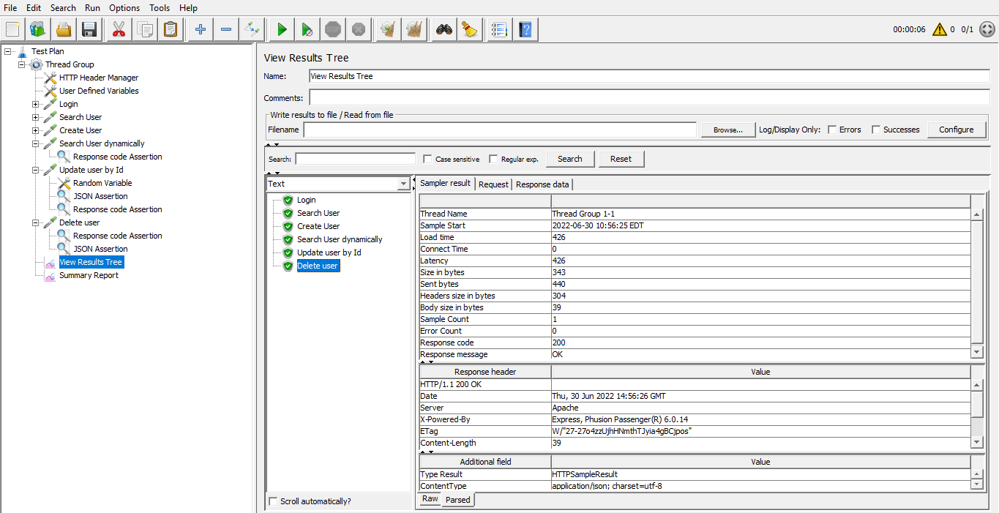

## JMeter Assignment 02

#### Solving Following Questions
1. Modify attached jmx file by adding update and delete request
2. Upload this jmx to github and create a readme file.

#### Reports

01. 

02. 

03. 

